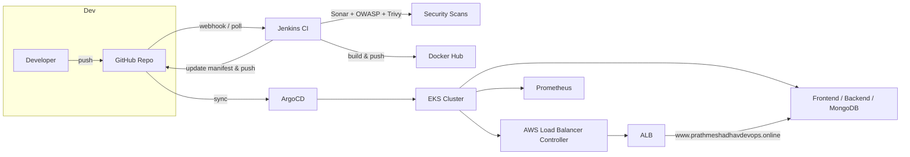

# End-to-End DevOps — Three-Tier Web Application on AWS EKS

This repository contains a complete DevSecOps pipeline for a three-tier web application (React frontend, Node.js backend, MongoDB), deployed on AWS EKS with CI/CD via Jenkins, GitOps via ArgoCD, and cluster monitoring via Prometheus.

## Contents

- [Architecture](#architecture)
- [Repository Layout](#repository-layout)
- [Components & Responsibilities](#components--responsibilities)
- [Cluster Setup (EKS + IRSA)](#cluster-setup-eks--irsa)
- [AWS Load Balancer Controller](#aws-load-balancer-controller)
- [CI / CD (Jenkins)](#ci--cd-jenkins)
- [Kubernetes Manifests & Deployment](#kubernetes-manifests--deployment)
- [Ingress & DNS](#ingress--dns)
- [GitOps (ArgoCD)](#gitops-argocd)
- [Monitoring (Prometheus)](#monitoring-prometheus)
- [Security & Scanning](#security--scanning)
- [Prerequisites](#prerequisites)
- [Deploy Steps (high level)](#deploy-steps-high-level)
- [Troubleshooting Notes](#troubleshooting-notes)
- [Next Steps](#next-steps)

---

## Architecture



- **Source control:** GitHub — [`PrathmeshAdhav2006/End-To-End-DevOps`](https://github.com/PrathmeshAdhav2006/End-To-End-DevOps)
- **CI:** Jenkins — separate pipelines for frontend and backend
- **Registry:** Docker Hub (`prathmeshadhav2006/frontend-app`, `prathmeshadhav2006/backend-app`)
- **Cluster:** AWS EKS, with IRSA (IAM Roles for Service Accounts) via an OIDC provider
- **Ingress:** AWS Load Balancer Controller provisioning an ALB
- **GitOps:** ArgoCD, syncing manifests from this repo to the cluster
- **Monitoring:** Prometheus (via Helm), no Grafana
- **DNS:** `www.prathmeshadhavdevops.online` → ALB (via CNAME)

---

## Repository Layout

- `Application-Code/`
  - `frontend/` — React app (`src/`, `public/`, `Dockerfile`, `package.json`)
  - `backend/` — Node.js backend (`index.js`, `models/`, `routes/`, `package.json`, `Dockerfile`)
- `Jenkins-Pipeline-Code/` — Jenkinsfiles for frontend and backend pipelines
- `Kubernetes-Manifests-file/`
  - `Frontend/` — Deployment, Service for the frontend
  - `Backend/` — Deployment, Service for the backend
  - `Database/` — MongoDB Deployment, PV/PVC, Secret
  - `ingress.yaml` — ALB Ingress resource

---

## Components & Responsibilities

- **Frontend** — React app, served via a Deployment + Service, exposed through the Ingress/ALB. Calls the backend API at `REACT_APP_BACKEND_URL`.
- **Backend** — Node.js API connecting to MongoDB (`mongodb-svc`), exposing endpoints under `/api`. Includes `/healthz`, `/ready`, `/started` probes.
- **Database** — MongoDB Deployment with PVC and a Secret (`mongo-sec`) for credentials.
- **Jenkins** — Runs CI: SonarQube analysis, Quality Gate check, OWASP Dependency-Check, Trivy filesystem scan, Docker build/push to Docker Hub, Trivy image scan, then updates the K8s manifest and pushes back to Git.
- **SonarQube** — Static code analysis with a Quality Gate step in the pipeline.
- **OWASP Dependency-Check** — Dependency vulnerability scanning (configured as a named tool `DP-Check` in Jenkins Global Tool Configuration, with an installer added).
- **Trivy** — Filesystem scan (pre-build) and image scan (post-push).
- **AWS Load Balancer Controller** — Provisions the ALB backing the Ingress, using IRSA to call AWS APIs.
- **ArgoCD** — GitOps sync of manifests from `Kubernetes-Manifests-file/` to the cluster.
- **Prometheus** — Cluster and workload metrics via `kube-prometheus-stack`/`prometheus` Helm chart (node-exporter, kube-state-metrics included).

---

## Cluster Setup (EKS + IRSA)

The AWS Load Balancer Controller needs AWS-level permissions from inside the cluster. This is done via **IRSA** (IAM Roles for Service Accounts), which bridges Kubernetes ServiceAccounts and AWS IAM using an OIDC provider.

1. **OIDC provider** — registered in IAM, trusting your EKS cluster's OIDC issuer.
2. **IAM policy** — `AWSLoadBalancerControllerIAMPolicy`, created from the [official policy JSON](https://raw.githubusercontent.com/kubernetes-sigs/aws-load-balancer-controller/v2.9.0/docs/install/iam_policy.json).
3. **IAM role + K8s ServiceAccount** — created together via `eksctl`:

```bash
eksctl create iamserviceaccount \
  --cluster=<your-cluster-name> \
  --region=<your-region> \
  --namespace=kube-system \
  --name=aws-load-balancer-controller \
  --role-name=AmazonEKSLoadBalancerControllerRole \
  --attach-policy-arn=arn:aws:iam::<account-id>:policy/AWSLoadBalancerControllerIAMPolicy \
  --approve
```

This creates the IAM role, its OIDC-scoped trust policy, the Kubernetes ServiceAccount `aws-load-balancer-controller` in `kube-system`, and annotates it with the role ARN — all linked, but the ServiceAccount (Kubernetes object) and the IAM role (AWS object) remain two separate systems bridged only by this annotation + trust policy.

---

## AWS Load Balancer Controller

Installed via Helm, using the ServiceAccount created above (not a Helm-managed one):

```bash
helm repo add eks https://aws.github.io/eks-charts
helm repo update

helm install aws-load-balancer-controller eks/aws-load-balancer-controller \
  -n kube-system \
  --set clusterName=<your-cluster-name> \
  --set serviceAccount.create=false \
  --set serviceAccount.name=aws-load-balancer-controller \
  --set vpcId=<your-vpc-id>
```

> **Note:** `vpcId` (and sometimes `region`) may need to be set explicitly if the controller can't auto-detect them via instance metadata — this showed up as a `CrashLoopBackOff` with a VPC ID error in this project until `vpcId` was set explicitly.

Verify:
```bash
kubectl get deployment -n kube-system aws-load-balancer-controller
kubectl logs -n kube-system deployment/aws-load-balancer-controller
```

---

## CI / CD (Jenkins)

Two pipelines — `Frontend` and `Backend` — following the same stage structure:

1. **Cleaning Workspace** — `cleanWs()`
2. **Checkout from Git** — pulls from `End-To-End-DevOps`, `branch: 'main'`
3. **Sonarqube Analysis** — `sonar-scanner` against the app's `Application-Code/<app>` directory
4. **Quality Check** — `waitForQualityGate abortPipeline: false`
5. **OWASP Dependency-Check Scan** — uses `odcInstallation: 'DP-Check'` (configured in Jenkins Global Tool Config, with an installer added and a version selected)
6. **Trivy File Scan** — `trivy fs .`
7. **Docker Image Build & Push** — builds and pushes to Docker Hub using a `dockerhub-cred` (Username/Password) credential
8. **TRIVY Image Scan** — scans the pushed image
9. **Checkout Code** — re-checkout for the manifest update step
10. **Update Deployment file** — updates the image tag in `deployment.yaml` via `sed`, commits, and pushes back to `main`, using `github-cred` (Secret Text credential, token-only)

### Required Jenkins credentials

| ID | Type | Used for |
|---|---|---|
| `github-cred` | Secret Text | Git checkout (public repo) and pushing manifest updates |
| `dockerhub-cred` | Username with password | Docker Hub login, build, push |
| `sonar-token` | Secret Text | SonarQube Quality Gate check |

### Required Jenkins tools (Global Tool Configuration)

| Tool | Name | Notes |
|---|---|---|
| NodeJS | `node` | Used for frontend/backend builds |
| SonarQube Scanner | `sonar-scanner` | Must match `SCANNER_HOME=tool '...'` in the pipeline |
| Dependency-Check | `DP-Check` | Must have **Install automatically** checked *and* an installer added with a version selected — otherwise the scan fails with `Couldn't find any executable in "null"` |

### Docker socket permissions

The `jenkins` user must be in the `docker` group to run `docker build`/`push`:

```bash
sudo usermod -aG docker jenkins
sudo systemctl restart jenkins
```

---

## Kubernetes Manifests & Deployment

```bash
kubectl apply -f Kubernetes-Manifests-file/Database/pv.yaml
kubectl apply -f Kubernetes-Manifests-file/Database/pvc.yaml
kubectl apply -f Kubernetes-Manifests-file/Database/deployment.yaml
kubectl apply -f Kubernetes-Manifests-file/Backend/deployment.yaml
kubectl apply -f Kubernetes-Manifests-file/Frontend/deployment.yaml
kubectl apply -f Kubernetes-Manifests-file/ingress.yaml
```

The backend Deployment reads Mongo credentials from a `mongo-sec` Secret and connects via `mongodb-svc:27017`. The frontend Deployment sets `REACT_APP_BACKEND_URL` — since this is a React app, this value is generally baked in at Docker **build time**, not read at container runtime, so it must match the domain the app is actually served from (`www.prathmeshadhavdevops.online`) at build time, not just in the K8s YAML.

---

## Ingress & DNS

- **Domain:** `prathmeshadhavdevops.online`
- **App is served at:** `www.prathmeshadhavdevops.online`, via a **CNAME** record pointing to the ALB's DNS hostname (e.g. `k8s-threetie-mainlb-....us-east-1.elb.amazonaws.com`)
- CNAME (not A record) is used because ALB IPs are not static.
- CNAME records can't be used at the bare root/apex (`@`) — only on a subdomain like `www`. An ALIAS/ANAME record would be needed to point the apex directly at the ALB, if desired.
- The Ingress `host:` field must match the DNS name exactly (`www.prathmeshadhavdevops.online`) for the ALB to route requests correctly by Host header.
- **HTTPS is not yet configured** — the ALB currently only has an HTTP (port 80) listener. To add HTTPS: request an ACM certificate for the domain, validate it via DNS, and add the `alb.ingress.kubernetes.io/certificate-arn` and `alb.ingress.kubernetes.io/listen-ports` annotations to the Ingress.

Get the ALB hostname:
```bash
kubectl get ingress -A
```

---

## GitOps (ArgoCD)

```bash
helm repo add argo https://argoproj.github.io/argo-helm
helm repo update

kubectl create namespace argocd
helm install argocd argo/argo-cd -n argocd
```

Access:
```bash
kubectl port-forward svc/argocd-server -n argocd 8080:443
```
Open `https://localhost:8080` — username `admin`, password from:
```bash
kubectl -n argocd get secret argocd-initial-admin-secret -o jsonpath="{.data.password}" | base64 -d
```

> If a Helm install fails partway (`context canceled` / `release name check failed`), the cleanest fix is usually to delete and recreate the `argocd` namespace rather than fight Helm's release-secret bookkeeping.

---

## Monitoring (Prometheus)

Prometheus only (no Grafana) — using the `prometheus-community/prometheus` chart:

```bash
helm repo add prometheus-community https://prometheus-community.github.io/helm-charts
helm repo update

kubectl create namespace monitoring
helm install prometheus prometheus-community/prometheus -n monitoring
```

This includes the Prometheus server, Alertmanager, node-exporter, kube-state-metrics, and pushgateway.

**Access:** since Jenkins/kubectl run on a jump/bastion server in this setup, `kubectl port-forward` alone only binds to that server — reach it from a local browser via an SSH tunnel:

```bash
# from your local machine
ssh -L 9090:localhost:9090 <user>@<jump-server-ip>

# on the jump server, in the same session
kubectl port-forward svc/prometheus-server -n monitoring 9090:80
```
Then open `http://localhost:9090` locally.

> If `prometheus-server` or `alertmanager` pods stay `Pending`, check for unbound PVCs (`kubectl get pvc -n monitoring`) and confirm a default StorageClass exists (`kubectl get storageclass`) — EKS does not ship with dynamic EBS provisioning by default; the EBS CSI driver add-on is required for PVCs to bind.

---

## Security & Scanning

- **SonarQube** — static analysis + Quality Gate, run per-app in the pipeline
- **OWASP Dependency-Check** — dependency vulnerability scan, report published via `dependencyCheckPublisher`
- **Trivy** — filesystem scan pre-build, image scan post-push
- **IRSA** — used for the AWS Load Balancer Controller instead of broad node IAM permissions, scoping AWS access to the specific ServiceAccount
- **Secrets** — MongoDB credentials via a Kubernetes Secret (`mongo-sec`); Jenkins credentials stored in Jenkins' credential store (Secret Text / Username-Password), never hardcoded in the Jenkinsfile

---

## Prerequisites

- AWS account with an existing EKS cluster and OIDC provider enabled
- `kubectl`, `helm`, `eksctl`, `aws` CLI configured on the Jenkins/jump host
- Jenkins with: NodeJS, SonarQube Scanner, and Dependency-Check tools configured; Docker installed and the `jenkins` user in the `docker` group
- A Docker Hub account/repo for image storage
- A domain with DNS management access (used here: `prathmeshadhavdevops.online`)

---

## Deploy Steps (high level)

1. Set up the OIDC provider → IAM policy → IAM role + ServiceAccount (IRSA) for the AWS Load Balancer Controller
2. Install the AWS Load Balancer Controller via Helm
3. Configure Jenkins tools and credentials (`DP-Check`, `sonar-scanner`, `dockerhub-cred`, `github-cred`, `sonar-token`)
4. Run the Frontend and Backend Jenkins pipelines to build, scan, and push images, and update the manifests
5. Apply (or let ArgoCD sync) the Kubernetes manifests, including `ingress.yaml`
6. Point DNS (CNAME on `www`) at the resulting ALB hostname
7. Install ArgoCD and Prometheus via Helm for GitOps and monitoring

---

## Troubleshooting Notes

- **`Warning: CredentialId "..." could not be found`** — check the credential exists under the exact ID in `Manage Jenkins → Credentials → System → Global credentials`, and that it isn't scoped to a different folder.
- **`Couldn't find any revision to build... refs/remotes/origin/master`** — the repo's default branch is `main`, not `master`; specify `branch: 'main'` in the `git` step.
- **`ERROR: Couldn't find any executable in "null"`** (Dependency-Check stage) — the `DP-Check` tool has "Install automatically" checked but no installer/version actually added; add one under `Manage Jenkins → Tools`.
- **`permission denied ... docker.sock`** — add `jenkins` to the `docker` group and restart the Jenkins service.
- **Docker build tag error (`docker build -t .`)** — always tag explicitly: `docker build -t <user>/<repo>:${BUILD_NUMBER} .`.
- **`git commit` fails with "nothing to commit"** — happens when the `sed`-updated tag is identical to what's already in `deployment.yaml` (e.g. `BUILD_NUMBER` coincides with the existing tag); safe to ignore, resolves on the next build with a different `BUILD_NUMBER`.
- **ALB pods `CrashLoopBackOff` on VPC ID** — set `vpcId` explicitly in the Helm install if auto-detection via instance metadata fails.
- **Site not reachable over `https://`** — confirm an HTTPS (443) listener actually exists on the ALB; without an ACM cert + ingress annotations, only `http://` will work.
- **Prometheus/Alertmanager pods stuck `Pending`** — check for unbound PVCs and a missing default StorageClass (EBS CSI driver).

---

## Next Steps

- Add HTTPS via ACM certificate + ALB HTTPS listener
- Install the EBS CSI driver / default StorageClass for Prometheus's persistent storage
- Add Grafana (or keep Prometheus-only, per current setup) with dashboards for the app and cluster
- Harden Jenkins (RBAC, CSRF, Vault-backed credentials)
- Move to a proper GitOps flow fully managed by ArgoCD instead of manual `kubectl apply`